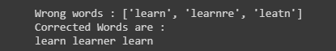

# Correct-spelling-by-NPL


<div align="center">
  <h3 align="center">OUTPUT</h3>
  <a href="https://github.com/othneildrew/Best-README-Template">
    <br><br><br>
    <a href="https://drive.google.com/file/d/1SfTTj28pf42eI22RTP3WImZh4mTaUl89/view?usp=sharing"><strong>Explore this code in google colaboratory »</strong></a>
  </a>
</div>

### Built With
* [python](https://www.python.org/)

python library used

* installing using pip
  ```sh
  pip install textblob
  ```
* installing with conda
  ```sh
  conda install -c conda-forge textblob
  python -m textblob.download_corpora
  ```
* Installing from Github source
  ```sh
  git clone https://github.com/sloria/TextBlob.git
  python setup.py install # inside the cloned directory
  ```
